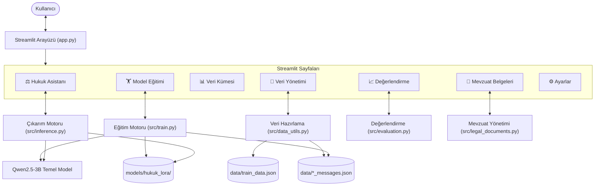
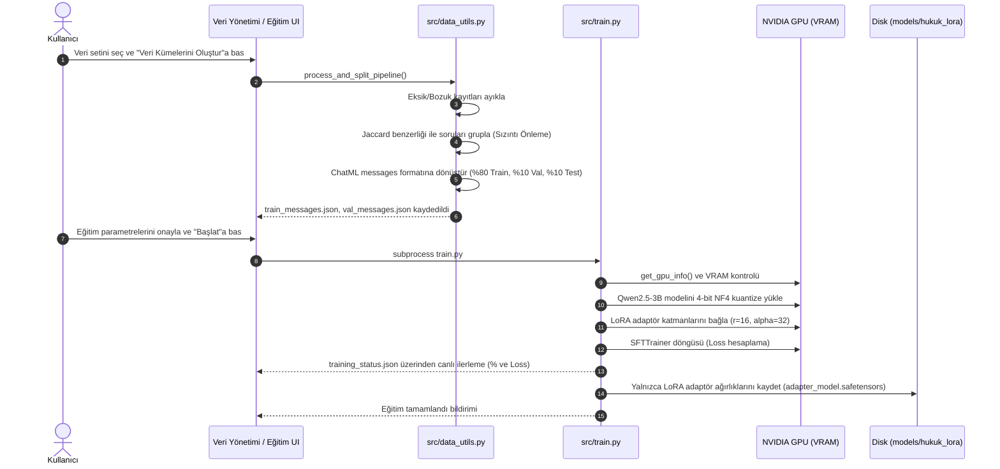
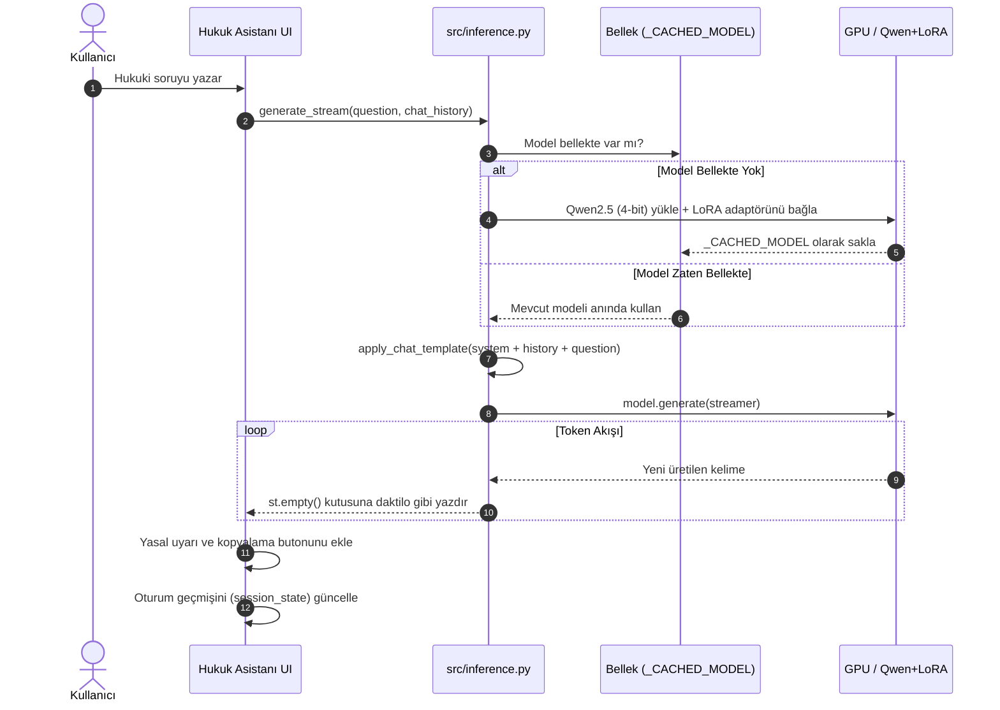

# ⚖️ Türk Hukuku Asistanı — Kapsamlı Teknik Mimari ve İşleyiş Dokümantasyonu

> **Belge Sürümü:** 1.0.0  
> **Son Güncelleme:** 2 Ekim 2026  
> **Temel Model:** `Qwen/Qwen2.5-3B-Instruct`  
> **Eğitim Yöntemi:** QLoRA (NF4 4-bit) + Supervised Fine-Tuning (SFT)  
> **Arayüz:** Python & Streamlit  

---

## İçindekiler
1. [Projenin Genel Amacı](#1-projenin-genel-amacı)
2. [Projenin Mimarisi](#2-projenin-mimarisi)
3. [Veri Setinin Hazırlanması](#3-veri-setinin-hazırlanması)
4. [QLoRA Fine-Tuning Süreci](#4-qlora-fine-tuning-süreci)
5. [Modelin Soru-Cevap Üretme Süreci](#5-modelin-soru-cevap-üretme-süreci)
6. [Mevzuat Belgelerinin Kullanımı ve Gerçek Durumu](#6-mevzuat-belgelerinin-kullanımı-ve-gerçek-durumu)
7. [Model Değerlendirme Süreci](#7-model-değerlendirme-süreci)
8. [Streamlit Arayüzünün İşleyişi](#8-streamlit-arayüzünün-işleyişi)
9. [Uçtan Uca Kullanım Senaryosu](#9-uçtan-uca-kullanım-senaryosu)
10. [Teknik Sınırlamalar ve Olası Hatalar](#10-teknik-sınırlamalar-ve-olası-hatalar)
11. [Projenin Tam İşleyiş Diyagramları](#11-projenin-tam-işleyiş-diyagramları)
12. [Dosya ve Fonksiyon Referansları Tablosu](#12-dosya-ve-fonksiyon-referansları-tablosu)
13. [Sonuç, Mevcut Durum ve Teknik Borç Analizi](#13-sonuç-mevcut-durum-ve-teknik-borç-analizi)

---

## 1. Projenin Genel Amacı

### 1.1 Problem Tanımı
Hukuki metinler, kanun maddeleri ve anayasal düzenlemeler; terminolojik yoğunluk, karmaşık atıflar ve dil yapısı nedeniyle hukukçu olmayan vatandaşlar ve temel hukuki bilgi arayan kullanıcılar için anlaşılması zor kaynaklardır. Genel amaçlı büyük dil modelleri (LLM'ler) Türk Hukuku'na özgü terminolojiye ve Türkiye Cumhuriyeti kanunlarına her zaman kesin ve gerekçeli cevaplar verememekte, zaman zaman genel veya yanıltıcı (halüsinasyon) yanıtlar üretebilmektedir.

### 1.2 Çözüm ve Projenin Amacı
**Türk Hukuku Asistanı**, Türkiye Cumhuriyeti Anayasası ve yürürlükteki kanunlara dayalı yaklaşık 15.000 soru-cevaplık doğrulanmış bir veri kümesini kullanarak açık kaynaklı **Qwen2.5-3B-Instruct** modelini **QLoRA (Quantized Low-Rank Adaptation)** ve **Supervised Fine-Tuning (SFT)** yöntemleriyle eğiten; ardından kullanıcıların hukuki sorularına gerekçeli, madde atıflı ve Türkçe dil kurallarına uygun yanıtlar sunan yerel bir yapay zekâ asistanıdır.

### 1.3 Temel Model ve İnce Ayar (Fine-Tuning) Yöntemi
* **Temel Model:** `Qwen/Qwen2.5-3B-Instruct` (Alibaba Cloud tarafından geliştirilen 3 milyar parametreli, güçlü akıl yürütme ve çok dilli kabiliyete sahip talimat modeli).
* **Fine-Tuning Yöntemi:** QLoRA (4-bit NormalFloat Kuantizasyonu + Düşük Dereceli Adaptasyon). Bu yöntem sayesinde 3 milyar parametreli bir model, tüketici sınıfı bir dizüstü bilgisayar GPU'sunda (örneğin 4 GB VRAM'e sahip NVIDIA RTX 3050 Ti) bellek taşması yaşamadan eğitilebilmektedir.

### 1.4 Kullanılan Teknolojiler ve Görevleri
| Teknoloji | Görevi ve Rolü |
| :--- | :--- |
| **Python (3.11 - 3.14)** | Projenin ana programlama dili. |
| **Streamlit** | Kullanıcı arayüzü; sohbet ekranı, veri analiz paneli, eğitim takibi ve mevzuat yönetimi. |
| **PyTorch (CUDA 12.6)** | GPU üzerinde tensör hesaplamaları ve derin öğrenme altyapısı. |
| **Hugging Face Transformers** | Model ve tokenizer yükleme, çıkarım boru hattı (`apply_chat_template`, `generate`). |
| **PEFT (Parameter-Efficient Fine-Tuning)** | LoRA adaptör katmanlarının oluşturulması ve ana modele bağlanması. |
| **TRL (Transformer Reinforcement Learning)** | `SFTTrainer` sınıfı ile denetimli ince ayar döngüsünün yürütülmesi. |
| **bitsandbytes** | 4-bit NF4 kuantizasyonu ve `paged_adamw_8bit` optimizer ile VRAM tasarrufu. |
| **Datasets** | Eğitim ve doğrulama verilerinin tensörleştirilmeye hazır formatta yönetimi. |
| **Plotly** | Eğitim ve doğrulama kayıplarının (loss) arayüzde canlı ve interaktif çizimi. |
| **Pandas** | Veri setlerinin tablo halinde filtrelenmesi ve istatistiklerinin çıkarılması. |

### 1.5 Mevcut Kapsam ve Sınırlamalar
* **Kapsam:** T.C. Anayasası ve temel kanun maddeleri hakkında soru-cevap yapabilme, veri kalitesi denetimi, sızıntısız veri bölme, canlı eğitim takibi.
* **Sınırlama:** Sistem avukat veya mahkeme yerine geçmez. Dinamik canlı RAG (vektör tabanlı anlık arama) henüz çıkarım hattına entegre edilmemiştir; model yanıtlarını ağırlıklarına işlenen bilgiler ve sistem istemi çerçevesinde üretir.

---

## 2. Projenin Mimarisi

### 2.1 Dosya ve Klasör Yapısı
Proje, gereksiz katmanlardan ve harici karmaşık bağımlılıklardan arındırılmış sade ve modüler bir mimaride düzenlenmiştir:

```
hukuki-rag-asistani/
├── README.md                      # Hızlı kurulum ve çalıştırma özeti
├── PROJE_DOKUMANTASYONU.md        # Detaylı teknik mimari ve kullanım belgesi (bu dosya)
├── app.py                         # Streamlit web arayüzü (tüm sayfalar tek merkezde)
├── config.py                      # Merkezi konfigürasyon (yollar, model adı, hiperparametreler)
├── requirements.txt               # Proje Python kütüphane bağımlılıkları
├── data/                          # Veri dosyaları
│   ├── train_data.json            # Ham soru-cevap veri seti (14.854 kayıt)
│   ├── train_messages.json        # %80 Eğitim kümesi (ChatML / messages formatı)
│   ├── val_messages.json          # %10 Doğrulama kümesi (ChatML / messages formatı)
│   ├── test_messages.json         # %10 Test kümesi (ChatML / messages formatı)
│   └── mevzuat/                   # Kanun ve yönetmelik metinleri (.txt, .md)
├── Dataset/                       # Orijinal ham veri yedekleri
│   ├── main_set.json              # 14.854 kayıtlık orijinal set
│   ├── train.json                 # 13.354 kayıtlık eski split
│   └── test.json                  # 1.500 kayıtlık eski split
├── models/                        # Model ağırlıkları çıktı dizini
│   └── hukuk_lora/                # Eğitilmiş LoRA adaptörü
│       ├── adapter_config.json    # LoRA yapılandırması (eğitim sonrası oluşur)
│       ├── adapter_model.safetensors # LoRA adaptör ağırlıkları (eğitim sonrası oluşur)
│       ├── training_status.json   # Canlı eğitim ilerleme durumu
│       └── training_history.json  # Adım adım kayıp (loss) geçmişi
└── src/                           # Modüler Python çekirdek kodları
    ├── __init__.py                # Python paket tanımlayıcısı
    ├── data_utils.py              # Veri okuma, temizleme, gruplu split ve ChatML dönüşümü
    ├── train.py                   # QLoRA (4-bit) SFT eğitim motoru ve GPU kontrolü
    ├── inference.py               # Bellekte tutulan model ile Türkçe çıkarım ve akış (stream)
    ├── evaluation.py              # Kelime örtüşmesi ve veri kümesi istatistikleri
    └── legal_documents.py         # Mevzuat dosyası okuma, kaydetme ve metin araması
```

### 2.2 Çekirdek Modüller ve Sorumlulukları
* **`config.py`:** Tüm dosya yolları, donanım limitleri (batch size, VRAM parametreleri), LoRA rank/alpha ve sistem istemi (`SYSTEM_PROMPT`) bu dosyadan yönetilir.
* **`src/data_utils.py`:** JSON/JSONL formatlarını okur; eksik, bozuk, kopya kayıtları ayıklar; benzer soruları akıllıca kümeleyerek **veri sızıntısız (data leakage-free)** %80 / %10 / %10 ayrımı yapar ve ChatML `messages` formatına dönüştürür.
* **`src/train.py`:** GPU uygunluğunu denetler, 4-bit kuantizasyonla modeli yükler, LoRA adaptörünü oluşturur, `SFTTrainer` ile eğitimi yürütür ve yalnızca LoRA adaptörünü kaydeder.
* **`src/inference.py`:** Modeli ve adaptörü belleğe tek seferlik yükler (`_CACHED_MODEL` singleton), her soru için tekrar disk okuması yapmaz; akışlı (`generate_stream`) veya toplu (`generate_answer`) metin üretir.
* **`src/evaluation.py`:** Test verisi üzerinde model yanıtlarını kelime örtüşme metrikleriyle kıyaslar; veri setinin kelime uzunluğu istatistiklerini hesaplar.
* **`src/legal_documents.py`:** `data/mevzuat/` dizinindeki kanun metinlerini listeler, okur, yeni metin kaydeder ve metin içi satır araması yapar.
* **`app.py`:** Streamlit tabanlı tek arayüz giriş noktasıdır; tüm sayfaları yönetir.

### 2.3 Eğitim ve Çıkarım Ayrımı
Model eğitimi ile soru-cevap çıkarımı birbirinden kesin olarak ayrılmıştır:
1. **Eğitim süreci (`src/train.py`):** Yüksek GPU kaynağı, gradyan hesaplaması ve bellek tahsisi gerektirir. Arka planda bağımsız bir süreç (`subprocess`) veya terminal üzerinden çalışır. Web arayüzünü kilitlemez.
2. **Çıkarım süreci (`src/inference.py`):** `torch.no_grad()` modunda çalışır; gradyan belleği harcamaz, 4-bit sıkıştırılmış model üzerinden yalnızca ileri besleme (forward pass) yapar.

---

## 3. Veri Setinin Hazırlanması

### 3.1 Ham Veri Formatı
Projede kullanılan ham veri ([data/train_data.json](file:///c:/Users/deniz/OneDrive/Masa%C3%BCst%C3%BC/hukuki-rag-asistani%20-%20Copy/data/train_data.json) ve [Dataset/main_set.json](file:///c:/Users/deniz/OneDrive/Masa%C3%BCst%C3%BC/hukuki-rag-asistani%20-%20Copy/Dataset/main_set.json)) **14.854 adet** hukuki soru-cevap çiftinden oluşmaktadır. Ham şema şu şekildedir:
```json
[
  {
    "Soru": "Anayasanın 118. Maddesi Hangi Tarihte Yürürlüğe Girmiştir?",
    "Cevap": "7 Kasım 1982'de yürürlüğe girmiştir."
  }
]
```

### 3.2 Veri Doğrulama ve Hata Yönetimi (`src/data_utils.py` -> `analyze_dataset`)
Veri hazırlama adımı şu 4 ana denetimi gerçekleştirir:
1. **Boş ve Eksik Kayıtlar:** `Soru` veya `Cevap` alanı `None`, boş string ya da yalnızca boşluk karakterlerinden oluşuyorsa kayıt hatalı olarak işaretlenir ve eğitime dahil edilmez.
2. **Bozuk Kayıtlar:** JSON ayrıştırma hatası içeren satırlar veya sözlük (dict) tipinde olmayan nesneler ayıklanır.
3. **Birebir Aynı Kayıtlar (Exact Duplicates):** Hem sorusu hem cevabı tamamen aynı olan kayıtlar tespit edilir; `deduplicate_exact=True` seçeneğiyle tekilleştirilir.
4. **Çelişkili Sorular (Farklı Cevaplı Aynı Sorular):** Soru metni aynı olmasına rağmen farklı cevaplar içeren durumlar raporlanır. **Hukuki güvenlik gereği, şüpheli veya farklı hukuki cevaplar otomatik olarak DEĞİŞTİRİLMEZ veya SİLİNMEZ**, kullanıcıya rapor olarak sunulur.

### 3.3 Veri Sızıntısını Önleyen Gruplu Bölme (`split_dataset_grouped`)
Geleneksel rastgele bölme (random split) yönteminde, aynı sorunun farklı varyantları hem eğitim hem test kümesine düşebilir. Bu durum modelin ezber yapmasına (data leakage) neden olur.
* `src/data_utils.py` içerisindeki `group_similar_questions` fonksiyonu, soruları Türkçe küçük harfe çevirip (`turkish_lower`) noktalama işaretlerinden arındırır.
* Jaccard kelime benzerliği (%85 ve üzeri) taşıyan sorular aynı kümede toplanır.
* Oluşturulan soru grupları bütün olarak **%80 Eğitim (11.884 kayıt)**, **%10 Doğrulama (1.485 kayıt)** ve **%10 Test (1.485 kayıt)** kümelerine ayrılır. Böylece bir sorunun varyantı eğitimdeyse, test setine asla sızamaz.

### 3.4 Messages Formatına Dönüştürme
TRL ve Qwen2.5 sohbet şablonuna tam uyum sağlamak için veriler `src/data_utils.py` içerisindeki `format_messages_entry` fonksiyonuyla şu standart yapıya dönüştürülür:

```json
{
  "messages": [
    {
      "role": "system",
      "content": "Sen Türk hukuku alanında uzmanlaşmış bir yapay zekâ asistanısın. Kullanıcının hukuki sorularına Türkiye Cumhuriyeti Anayasası ve yürürlükteki kanunlar çerçevesinde doğru, anlaşılır ve gerekçeli yanıtlar ver. Yanıtlarında ilgili kanun maddelerini belirt."
    },
    {
      "role": "user",
      "content": "Erginlik kaç yaşında başlar?"
    },
    {
      "role": "assistant",
      "content": "Türk Medeni Kanunu'na göre erginlik 18 yaşın doldurulmasıyla başlar."
    }
  ]
}
```

Hazırlanan dosyalar orijinal dosyaların üzerine yazılmadan [data/train_messages.json](file:///c:/Users/deniz/OneDrive/Masa%C3%BCst%C3%BC/hukuki-rag-asistani%20-%20Copy/data/train_messages.json), [data/val_messages.json](file:///c:/Users/deniz/OneDrive/Masa%C3%BCst%C3%BC/hukuki-rag-asistani%20-%20Copy/data/val_messages.json) ve [data/test_messages.json](file:///c:/Users/deniz/OneDrive/Masa%C3%BCst%C3%BC/hukuki-rag-asistani%20-%20Copy/data/test_messages.json) olarak kaydedilir (`ensure_ascii=False` ile Türkçe karakterler korunur).

---

## 4. QLoRA Fine-Tuning Süreci

### 4.1 QLoRA Nedir ve Neden Tercih Edilmiştir?
Tam model eğitimi (Full Fine-Tuning), 3 milyar parametreli bir model için 16-bit hassasiyette en az 16-24 GB VRAM gerektirir.
**QLoRA (Quantized Low-Rank Adaptation)** şu iki tekniği birleştirerek bu ihtiyacı ~3.5 GB VRAM seviyesine indirir:
1. **4-bit NormalFloat (NF4) Kuantizasyonu:** Temel model ağırlıkları 16-bit'ten 4-bit'e sıkıştırılır. Bu sayede model bellekte ~6 GB yerine ~1.8 GB yer kaplar.
2. **LoRA (Düşük Dereceli Uyarlama):** Temel model ağırlıkları dondurulur (frozen). Modelin dikkat (attention) ve MLP katmanlarına küçük, eğitilebilir rank matrisleri (A ve B) eklenir. Yalnızca bu matrisler eğitilir (tüm modelin yaklaşık %0.5 - %1'i).

### 4.2 Hiperparametreler ve Görevleri
Projede [config.py](file:///c:/Users/deniz/OneDrive/Masa%C3%BCst%C3%BC/hukuki-rag-asistani%20-%20Copy/config.py) üzerinde tanımlı ve arayüzden değiştirilebilen parametreler:

| Parametre | Varsayılan Değer | Görevi ve Açıklaması |
| :--- | :---: | :--- |
| `BASE_MODEL_NAME` | `Qwen/Qwen2.5-3B-Instruct` | Eğitilecek temel açık kaynaklı dil modeli. |
| `LORA_R` | `16` | LoRA matrislerinin rank değeri (kapasite/bellek dengesi). |
| `LORA_ALPHA` | `32` | LoRA ölçekleme katsayısı (genelde 2 * r seçilir). |
| `LORA_DROPOUT` | `0.05` | Aşırı öğrenmeyi (overfitting) önleyen dropout oranı. |
| `LORA_TARGET_MODULES` | `q, k, v, o, gate, up, down` | LoRA adaptörünün ekleneceği dikkat ve feed-forward katmanları. |
| `BNB_4BIT_QUANT_TYPE` | `"nf4"` | Normal dağılıma optimize kuantizasyon veri türü. |
| `BNB_4BIT_COMPUTE_DTYPE` | `"bfloat16"` | 4-bit ağırlıklarla işlem yapılırken kullanılan hesaplama türü. |
| `TRAIN_EPOCHS` | `2` | Tüm eğitim veri setinin modelden kaç kez geçeceği. |
| `TRAIN_BATCH_SIZE` | `1` | Tek adımda GPU'ya gönderilen örnek sayısı (4 GB VRAM için 1 zorunludur). |
| `GRADIENT_ACCUMULATION_STEPS` | `8` | Gradyanların kaç adımda bir biriktirilip güncelleneceği (Efektif batch size = 1 * 8 = 8). |
| `LEARNING_RATE` | `0.0002` | Öğrenme hızı (AdamW için ideal LoRA aralığı). |
| `MAX_SEQ_LENGTH` | `512` | Token bazında maksimum girdi + çıktı uzunluğu. |
| `OPTIMIZER` | `"paged_adamw_8bit"` | VRAM taşmasında RAM'e sayfalama yapabilen 8-bit optimizer. |
| `LR_SCHEDULER` | `"cosine"` | Öğrenme oranını kosinüs eğrisiyle azaltan zamanlayıcı. |

### 4.3 Eğitim Döngüsü ve Dosya Kayıt Mekanizması
1. **Veri Yükleme:** `validate_and_prepare_datasets()` fonksiyonu ile `train_messages.json` ve `val_messages.json` okunur.
2. **Kuantizasyonlu Model:** `BitsAndBytesConfig` ile model yüklenir ve `prepare_model_for_kbit_training()` uygulanır.
3. **PEFT Model:** `get_peft_model(model, lora_config)` çağrılarak LoRA katmanları eklenir.
4. **İlerleme Callback'i:** `LiveProgressCallback` her log adımında (10 adımda bir) `models/hukuk_lora/training_status.json` ve `models/hukuk_lora/training_history.json` dosyalarını günceller.
5. **Yalnızca Adaptörün Kaydedilmesi:** Eğitim bittiğinde 6 GB'lık temel model DEĞİL, yalnızca eğitilen LoRA adaptörü [models/hukuk_lora/](file:///c:/Users/deniz/OneDrive/Masa%C3%BCst%C3%BC/hukuki-rag-asistani%20-%20Copy/models/hukuk_lora/) klasörüne kaydedilir:
   - `adapter_config.json` (~1 KB)
   - `adapter_model.safetensors` (~50-100 MB)
   - Tokenizer dosyaları

### 4.4 Checkpoint'ten Devam Etme Durumu (Önemli Not)
* **Mevcut Durum:** `train.py` dosyasında `save_strategy="epoch"` tanımlıdır. Ancak `trainer.train()` çağrısına henüz `resume_from_checkpoint=True` parametresi bağlanmamıştır. Dolayısıyla bir eğitim yarım kaldığında mevcut kod sıfırdan başlar; checkpoint'ten devam etme özelliği bir sonraki geliştirme adımı olarak önerilmektedir.

---

## 5. Modelin Soru-Cevap Üretme Süreci

Kullanıcı arayüzde bir soru yazdığı andan cevabın ekranda belirmesine kadar gerçekleşen adımlar sırasıyla şunlardır:

```
[Kullanıcı Sorusu] 
       │
       ▼
[app.py: st.chat_input] ──> session_state.chat_history'ye eklenir
       │
       ▼
[src/inference.py: load_model()] ──> Model bellekte var mı?
       ├── Evet: _CACHED_MODEL doğrudan kullanılır (Sıfır yükleme süresi)
       └── Hayır: Qwen2.5 (4-bit) + LoRA adaptörü GPU belleğine yüklenir
       │
       ▼
[build_prompt_messages()] ──> System Prompt + Geçmiş Mesajlar + Yeni Soru birleştirilir
       │
       ▼
[tokenizer.apply_chat_template()] ──> Qwen2.5 ChatML formatına (<|im_start|>...) dönüştürülür
       │
       ▼
[tokenizer() -> model.device] ──> Metin girdi tensörlerine (input_ids) çevrilir
       │
       ▼
[model.generate() + TextIteratorStreamer] ──> GPU üzerinde ileri besleme ve token örnekleme
       │
       ▼
[generate_stream() yield] ──> Kelime kelime Streamlit st.empty() kutusuna daktilo gibi yazılır
       │
       ▼
[Yasal Uyarı & Kopyalama Butonu] ──> Cevabın altına eklenir ve session_state güncellenir
```

### 5.1 Adım Adım Kod Akışı
1. **Girdi Alma:** `app.py` line 180: `user_input = st.chat_input(...)` ile soru alınır.
2. **Bellek Kontrolü:** `src/inference.py` line 70: `_CACHED_MODEL` kontrol edilir. Model daha önce yüklendiyse anında cevap üretimine geçilir.
3. **ChatML Şablonu:** `tokenizer.apply_chat_template(messages, add_generation_prompt=True)` ile Qwen'in beklediği özel belirteçler (`<|im_start|>system...<|im_end|>`) yerleştirilir.
4. **Akışlı Üretim (Streaming):** `src/inference.py` line 241: `generate_stream()` fonksiyonu ayrı bir thread'de `TextIteratorStreamer` çalıştırır; Streamlit arayüzünde cevap canlı olarak akar.
5. **Yasal Uyarı Gösterimi:** Her cevabın altına kanuni zorunluluk gereği şu metin eklenir:
   > *"Bu yanıt yapay zekâ tarafından oluşturulmuştur. Hukuki danışmanlık yerine geçmez. Güncel mevzuat ve somut olay bakımından ayrıca doğrulanmalıdır."*
6. **Kopyalama Desteği:** `st.code` kutusu ile tek tıkla panoya kopyalama olanağı sunulur.

---

## 6. Mevzuat Belgelerinin Kullanımı ve Gerçek Durumu

### 6.1 Mevcut Mevzuat Modülü (`src/legal_documents.py`)
Projede [data/mevzuat/](file:///c:/Users/deniz/OneDrive/Masa%C3%BCst%C3%BC/hukuki-rag-asistani%20-%20Copy/data/mevzuat/) dizini altında kanun ve mevzuat metinlerinin saklanması için modüler bir yapı mevcuttur:
* `list_documents()`: Klasördeki `.txt`, `.json`, `.md` dosyalarını listeler.
* `read_document(path)`: Seçilen belgenin tüm metnini okur.
* `save_document(filename, content)`: Arayüzden yeni mevzuat metni kaydeder.
* `search_in_documents(query)`: Belgeler içerisinde büyük/küçük harfe duyarsız basit satır bazlı alt metin araması (substring search) yapar.

### 6.2 ⚠️ Kritik Değerlendirme: Mevzuat Model Çıkarımına Entegre mi?
* **Gerçek Durum:** **HAYIR.** Mevcut kod tabanında [src/legal_documents.py](file:///c:/Users/deniz/OneDrive/Masa%C3%BCst%C3%BC/hukuki-rag-asistani%20-%20Copy/src/legal_documents.py) dosyası ile [src/inference.py](file:///c:/Users/deniz/OneDrive/Masa%C3%BCst%C3%BC/hukuki-rag-asistani%20-%20Copy/src/inference.py) arasında bir RAG (Retrieval-Augmented Generation) bağlantısı **bulunmamaktadır.**
* Model, soruya yanıt verirken `data/mevzuat/` klasöründeki dosyalardan anlık arama yapmaz; yanıtlarını yalnızca **fine-tuning sırasında LoRA adaptörüne öğrendiği parametrik bilgilerden** ve `SYSTEM_PROMPT` talimatından üretir.
* Arayüzdeki "📜 Mevzuat Belgeleri" sayfası şu anda kullanıcıların kanun metinlerini elle okuyup arayabileceği bağımsız bir referans kütüphanesidir.
* **Mevzuat Güncelliği Takibi:** Yürürlükteki mevzuat değişikliklerini anlık internetten veya Resmi Gazete'den çeken otomatik bir mekanizma yoktur; mevzuat dosyalarının kullanıcı tarafından elle güncellenmesi gerekir.

---

## 7. Model Değerlendirme Süreci

### 7.1 Değerlendirme Yöntemi (`src/evaluation.py`)
* `evaluate_model(model, tokenizer, test_data, max_samples=50)` fonksiyonu, test kümesinden seçilen örnek soruları modele sorar.
* Modelin ürettiği metin ile veri setindeki beklenen gerçek cevap (ground truth) arasında **Jaccard kelime örtüşme skoru (Word Overlap Score)** hesaplar:
  $$\text{Örtüşme} = \frac{|\text{Beklenen Kelimeler} \cap \text{Üretilen Kelimeler}|}{|\text{Beklenen Kelimeler}|}$$

### 7.2 Veri Kümesi İstatistikleri (`compute_dataset_stats`)
Model yüklenmeden de çalışabilen bu fonksiyon; soru ve cevapların ortalama, minimum ve maksimum kelime uzunluklarını hesaplar. (Örn: Soru ortalama 10.6 kelime, cevap ortalama 24.2 kelime).

### 7.3 Eğitim Kaybı (Loss) vs Hukuki Doğruluk
* **Eğitim Kaybı (Cross-Entropy Loss):** Modelin bir sonraki token'ı doğru tahmin etme olasılığını ölçer. Düşük loss, modelin metin yapısını ve üslubunu iyi öğrendiğini gösterir.
* **Hukuki Doğruluk:** Düşük loss her zaman hukuki doğruluğu garanti etmez. Bir kelimenin eksikliği (örn. "edilebilir" yerine "edilemez") hukuki anlamı 180 derece değiştirebilir.
* **Otomatik Değerlendirmenin Sınırları:** Kelime örtüşmesi eşanlamlı kelimeleri (örn: "erginlik" vs "reşitlik") veya hukuki mantık zincirini tam olarak değerlendiremez. Kesin doğruluk için hukuk uzmanları tarafından kör test (blind evaluation) yapılması önerilir.

---

## 8. Streamlit Arayüzünün İşleyişi

Uygulama [app.py](file:///c:/Users/deniz/OneDrive/Masa%C3%BCst%C3%BC/hukuki-rag-asistani%20-%20Copy/app.py) üzerinden 7 farklı sayfayla hizmet verir:

### 8.1 ⚖️ Hukuk Asistanı (Sohbet Sayfası)
* **Amaç:** Kullanıcıların hukuki soru sorup modelden yanıt alması.
* **Kullanıcı İşlemleri:** Mesaj yazma, örnek soru butonlarına tıklama, sohbeti temizleme, çıkarım parametrelerini (temperature, top-p, max tokens) ayarlama, cevapları kopyalama.
* **Kullanılan Fonksiyonlar:** `is_model_ready()`, `get_model_status_info()`, `generate_stream()`.
* **Dosya Etkileşimi:** `models/hukuk_lora/` adaptörünü okur; `st.session_state.chat_history` oturumunda sohbeti tutar.

### 8.2 📁 Veri Yönetimi
* **Amaç:** Ham veri setinin analizi, temizlenmesi ve sızıntısız bölünüp kaydedilmesi.
* **Kullanıcı İşlemleri:** Bilgisayardan JSON/JSONL yükleme veya mevcut `train_data.json` dosyasını seçme, hatalı/kopya/çelişkili kayıtları inceleme, %80/%10/%10 bölme işlemini başlatma, hazırlanan JSON dosyalarını ve analiz raporunu indirme.
* **Kullanılan Fonksiyonlar:** `load_file_content()`, `analyze_dataset()`, `process_and_split_pipeline()`.
* **Dosya Etkileşimi:** `data/train_data.json` okur; `data/train_messages.json`, `data/val_messages.json`, `data/test_messages.json` yazar.

### 8.3 📊 Veri Kümesi
* **Amaç:** Kümelerdeki verileri sekmeler halinde görüntülemek.
* **Kullanıcı İşlemleri:** `Train (Messages)`, `Val (Messages)`, `Eski Train`, `Eski Test` ve `Main Set` sekmelerinde kayıt sayılarını ve ilk 10 örnek kaydı inceleme.
* **Kullanılan Fonksiyonlar:** `load_json()`, `validate_dataset()`, `compute_dataset_stats()`.

### 8.4 🏋️ Model Eğitimi
* **Amaç:** QLoRA eğitim sürecini yapılandırmak, başlatmak ve izlemek.
* **Kullanıcı İşlemleri:** GPU/VRAM durumunu izleme, epoch/batch/learning rate değerlerini düzenleme, onay kutusunu işaretleyip eğitimi başlatma veya çalışan eğitimi durdurma, kayıp grafiğini inceleme.
* **Kullanılan Fonksiyonlar:** `get_gpu_info()`, `get_training_status()`, `is_training_running()`, `stop_training_process()`.
* **Dosya Etkileşimi:** `models/hukuk_lora/training_status.json` ve `training_history.json` dosyalarını okur; arka planda `src/train.py` sürecini başlatır.

### 8.5 📈 Değerlendirme
* **Amaç:** Modelin test seti üzerindeki performansını ölçmek.
* **Kullanıcı İşlemleri:** Test veri kümesi kelime istatistiklerini inceleme. Model eğitilmişse örnekler üzerinde örtüşme testini görüntüleme.
* **Kullanılan Fonksiyonlar:** `compute_dataset_stats()`, `evaluate_model()`.

### 8.6 📜 Mevzuat Belgeleri
* **Amaç:** Kanun metinlerini incelemek ve aramak.
* **Kullanıcı İşlemleri:** Mevcut belgeleri okuma, yeni `.txt` belgesi yükleme, metin içinde anahtar kelime arama.
* **Kullanılan Fonksiyonlar:** `list_documents()`, `read_document()`, `save_document()`, `search_in_documents()`.
* **Dosya Etkileşimi:** `data/mevzuat/` klasörüne yazar ve okur.

### 8.7 ⚙️ Ayarlar
* **Amaç:** `config.py` içerisindeki tüm sabitleri ve aktif sistem istemini (`SYSTEM_PROMPT`) salt-okunur olarak görüntülemek.

---

## 9. Uçtan Uca Kullanım Senaryosu

Projeyi ilk kez kullanacak bir kullanıcının izleyeceği 10 aşamalı yol haritası:

1. **Ortamın Hazırlanması:**
   ```powershell
   python -m venv venv
   .\venv\Scripts\activate
   ```
2. **Kütüphanelerin Yüklenmesi:**
   ```powershell
   pip install -r requirements.txt
   pip install torch torchvision --index-url https://download.pytorch.org/whl/cu126
   ```
3. **Uygulamanın Başlatılması:**
   ```powershell
   streamlit run app.py
   ```
4. **Veri Yönetimi Sayfasına Geçiş:**
   Sol menüden **📁 Veri Yönetimi** açılır. `data/train_data.json` seçilir. Veri kalitesi incelenir.
5. **Veri Kümelerinin Oluşturulması:**
   "🚀 Veri Kümelerini Oluştur" butonuna basılır. Sistem 14.854 kaydı analiz eder, kopyaları ayıklar ve `data/` altına `train_messages.json`, `val_messages.json`, `test_messages.json` dosyalarını üretir.
6. **Model Eğitimi Sayfasına Geçiş:**
   Sol menüden **🏋️ Model Eğitimi** sayfasına geçilir. Ekran kartının (örn. RTX 3050 Ti - 4.0 GB VRAM) tanındığı teyit edilir.
7. **Eğitimin Başlatılması:**
   Parametreler kontrol edilir (Epoch: 2, Batch Size: 1, Gradient Accum: 8). "Model eğitimini başlatmayı onaylıyorum" kutucuğu işaretlenir ve "🚀 QLoRA Model Eğitimini Başlat" butonuna tıklanır.
8. **İlerlemenin İzlenmesi:**
   Canlı ilerleme çubuğu, loss değerleri ve Plotly grafiği takip edilir. Eğitim tamamlandığında yeşil bildirim mesajı alınır.
9. **Hukuk Asistanı ile Sohbet:**
   Sol menüden **⚖️ Hukuk Asistanı** sayfasına geçilir. Durum göstergesinin "LoRA adaptörü mevcut" olduğunu görülür.
10. **Soru Sorma ve Çıktı Alma:**
    Örneğin *"Erginlik kaç yaşında başlar?"* sorusu yazılır. Model GPU belleğine tek seferde yüklenir ve gerekçeli hukuki cevabı ekranda canlı olarak akar. İstenirse "Yanıtı Kopyala" ile metin panoya alınır.

---

## 10. Teknik Sınırlamalar ve Olası Hatalar

### 10.1 GPU ve Donanım Riskleri
* **GPU Bulunmaması (CPU Ortamı):** QLoRA 4-bit ağırlıkları `bitsandbytes` ile CPU üzerinde eğitilemez. `train.py` içerisindeki `check_gpu()` fonksiyonu CUDA yoksa işlemi bilinçli olarak durdurur ve kullanıcıya net bir Türkçe hata gösterir.
* **CUDA Out of Memory (OOM):** 4 GB VRAM'e sahip kartlarda `TRAIN_BATCH_SIZE > 1` veya `MAX_SEQ_LENGTH > 512` yapıldığında CUDA bellek yetersizliği hatası alınabilir. `train.py`, OOM hatasını yakalar ve kullanıcıya batch size'ı 1 tutması ve gradient accumulation'ı artırması yönünde tavsiye üretir.

### 10.2 Hukuki ve Veri Riskleri
* **Halüsinasyon Riski:** Dil modelleri bazen var olmayan kanun maddeleri veya eski yürürlük tarihlerini uydurabilir. Model cevaplarının altındaki yasal uyarı bu nedenle zorunlu tutulmuştur.
* **Çelişkili Veri:** Veri kümesinde aynı soruya verilmiş farklı cevaplar (99 adet tespit edilmiştir) otomatik silinmemiştir; bu durum modelin bazı sorulara birden fazla olası yorum üretmesine yol açabilir.

---

## 11. Projenin Tam İşleyiş Diyagramları

### 11.1 Uygulamanın Genel Mimarisi



### 11.2 Veri Hazırlama ve QLoRA Eğitim Süreci



### 11.3 Soru-Cevap Çıkarım (Inference) Akışı



---

## 12. Dosya ve Fonksiyon Referansları Tablosu

Aşağıdaki tablo, projenin kaynak kodlarındaki ana fonksiyonların girdi, çıktı ve satır numarası referanslarını listelemektedir:

| Dosya | Fonksiyon / Sınıf | Satır Aralığı | Girdiler | Çıktı / İşlem |
| :--- | :--- | :---: | :--- | :--- |
| `src/data_utils.py` | `turkish_lower` | L30 - L43 | `text: str` | Türkçe İ/i ve I/ı karakterlerini koruyarak küçük harfe çevirir. |
| `src/data_utils.py` | `clean_and_normalize_text` | L46 - L55 | `text: str` | Noktalama ve fazla boşlukları temizler. |
| `src/data_utils.py` | `extract_qa_pair` | L58 - L75 | `item: Any` | Farklı JSON formatlarından soru ve cevap metinlerini çeker. |
| `src/data_utils.py` | `load_file_content` | L80 - L165 | `source, filename` | JSON veya JSONL formatındaki dosyayı/akışı okur. |
| `src/data_utils.py` | `analyze_dataset` | L175 - L295 | `data: List` | Eksik, bozuk, kopya ve çelişkili kayıtları analiz eder. |
| `src/data_utils.py` | `group_similar_questions` | L318 - L385 | `records: List` | Union-Find algoritmasıyla benzer soruları kümeleyerek sızıntıyı önler. |
| `src/data_utils.py` | `split_dataset_grouped` | L388 - L450 | `records, ratios, seed` | Grupları bölmeden %80 train, %10 val, %10 test olarak ayırır. |
| `src/data_utils.py` | `format_messages_entry` | L454 - L486 | `soru, cevap, prompt` | Standart ChatML `messages` sözlüğü üretir. |
| `src/data_utils.py` | `process_and_split_pipeline`| L529 - L598 | `raw_data, output_dir` | Baştan sona veri hazırlama boru hattını çalıştırır ve kaydeder. |
| `src/train.py` | `get_gpu_info` | L42 - L94 | — | GPU adı, VRAM miktarı, CUDA durumu ve uygunluk sözlüğü döner. |
| `src/train.py` | `get_training_status` | L118 - L142 | — | `training_status.json` dosyasını okur ve PID liveness kontrolü yapar. |
| `src/train.py` | `is_training_running` | L158 - L166 | — | Arka planda aktif eğitim olup olmadığını denetler (Process lock). |
| `src/train.py` | `stop_training_process` | L169 - L188 | — | Çalışan eğitim sürecini `psutil` ile sonlandırır. |
| `src/train.py` | `create_training_callback`| L193 - L279 | `history_file, status_file`| Her adımda loss ve ilerlemeyi diske yazan `TrainerCallback` üretir. |
| `src/train.py` | `validate_and_prepare_datasets`| L284 - L338 | — | Messages formatındaki train ve val verilerini yükler. |
| `src/train.py` | `train` | L343 - L485 | `overrides: Optional[dict]`| 4-bit QLoRA + SFT eğitimini yürütür, adaptörü kaydeder. |
| `src/inference.py` | `is_model_ready` | L31 - L48 | `adapter_dir: Optional[str]`| LoRA adaptör ağırlıklarının diskte varlığını doğrular. |
| `src/inference.py` | `load_model` | L66 - L146 | `adapter_path, force_reload`| Modeli belleğe tek seferlik yükler (`_CACHED_MODEL` singleton). |
| `src/inference.py` | `unload_model` | L149 - L160 | — | Bellekteki modeli temizler ve CUDA önbelleğini boşaltır. |
| `src/inference.py` | `generate_answer` | L191 - L238 | `question, chat_history, params`| Tek seferlik metin üretir. |
| `src/inference.py` | `generate_stream` | L241 - L295 | `question, chat_history, params`| Canlı daktilo akışı (streaming generator) sağlar. |
| `src/evaluation.py` | `evaluate_model` | L14 - L54 | `model, tokenizer, test_data`| Kelime örtüşme skoru hesaplar. |
| `src/evaluation.py` | `compute_dataset_stats` | L56 - L80 | `file_path: str` | Kelime uzunluğu istatistiklerini hesaplar. |
| `src/legal_documents.py`| `search_in_documents` | L41 - L65 | `query: str` | Mevzuat metinleri içinde arama yapar. |

---

## 13. Sonuç, Mevcut Durum ve Teknik Borç Analizi

### 13.1 Projenin Mevcut Durum Özeti
* ✅ **Tamamlanmış ve Çalışan Özellikler:**
  1. 14.854 kayıtlık veri setinin okunması, kalitesinin denetlenmesi, sızıntısız %80 / %10 / %10 bölünmesi ve standart `messages` formatında saklanması.
  2. NVIDIA RTX 3050 Ti (4 GB VRAM) üzerinde 4-bit NF4 kuantizasyonu ve LoRA ile Qwen2.5-3B modelinin eğitilebilir hale getirilmesi.
  3. Çift çalıştırmayı engelleyen process kilidi ve canlı kayıp (loss) takibi.
  4. Eğitilen LoRA adaptörünün belleğe tek seferde alınıp önbelleklenmesi (`_CACHED_MODEL`) ve akışlı (streaming) Türkçe cevap üretimi.
  5. Streamlit tabanlı modern ve modüler web arayüzü.
  6. Eski LangGraph/Chroma kalıntılarının temizlenmesi ile hafif ve kararlı kod yapısı.

### 13.2 Teknik Borçlar ve Önerilen Gelecek Geliştirmeler
1. **RAG Entegrasyonu (Retrieval-Augmented Generation):**
   * *Mevcut Durum:* `src/legal_documents.py` bağımsız çalışmaktadır.
   * *Geliştirme Önerisi:* `data/mevzuat/` klasöründeki kanun metinleri bir vektör veritabanına (örneğin FAISS veya Chroma) gömülmeli ve `src/inference.py` dosyasında soru sorulduğunda en ilgili kanun maddesi dinamik olarak prompt'a enjekte edilmelidir.
2. **Yarıda Kalan Eğitimi Devam Ettirme (Checkpoint Resume):**
   * *Mevcut Durum:* Eğitim durdurulduğunda baştan başlar.
   * *Geliştirme Önerisi:* `src/train.py` içerisine `resume_from_checkpoint=True` argümanı eklenerek en son kaydedilen epoch checkpoint'inden devam edebilme esnekliği sağlanmalıdır.
3. **Gelişmiş Değerlendirme Metrikleri:**
   * *Mevcut Durum:* Yalnızca kelime örtüşmesi (Word Overlap) hesaplanmaktadır.
   * *Geliştirme Önerisi:* Hukuki benzerliği daha iyi ölçmek için ROUGE-L, BLEU veya LLM-as-a-Judge (başka bir hakem modelle puanlama) metrikleri entegre edilmelidir.
4. **Sohbet Geçmişini Kalıcılaştırma:**
   * *Mevcut Durum:* `st.session_state` tarayıcı yenilendiğinde sıfırlanır.
   * *Geliştirme Önerisi:* İlerleyen aşamalarda SQLite tabanlı yerel bir konuşma veritabanı eklenebilir.

---
*Bu dokümantasyon, projenin mevcut kaynak kodları satır satır incelenerek ve doğrulanarak hazırlanmıştır.*
